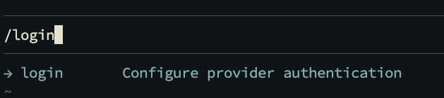
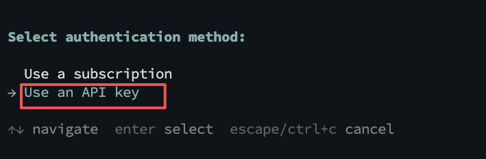
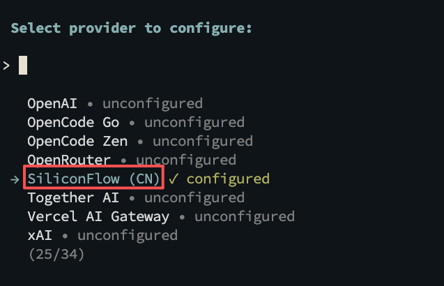
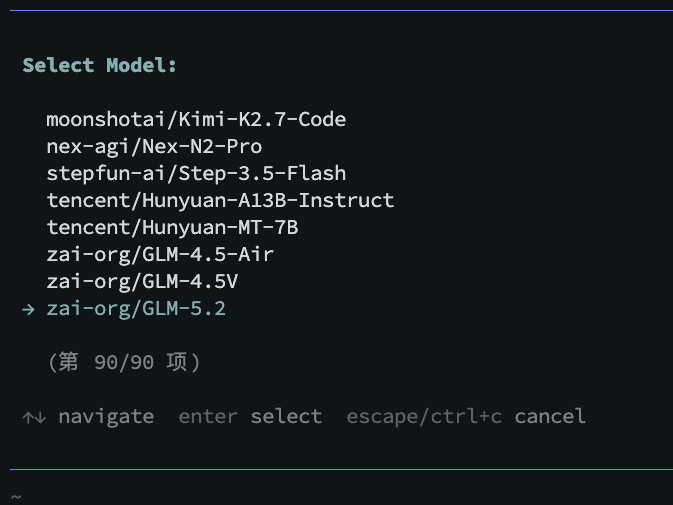
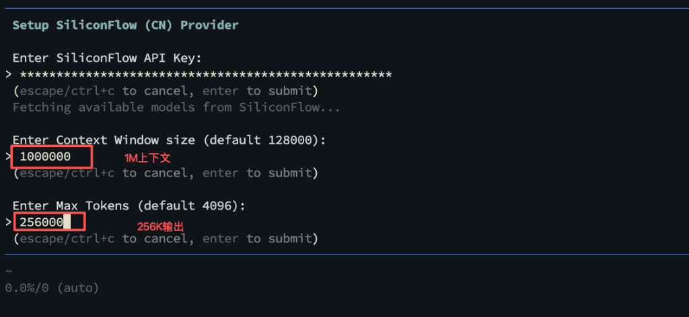
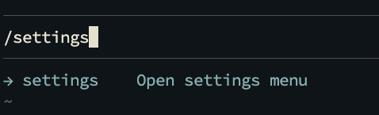
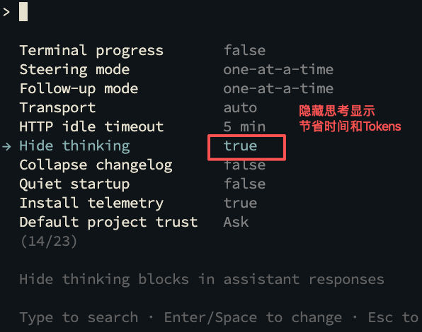

# Forenyx AI CLI

> **芯片验证工程师专属的闭源智能编码 Agent 终端。**
> 免源码、零依赖，支持快速部署。

---

## 快速安装与启动 (Linux & macOS)

请在您的 Linux 或 macOS 终端中运行以下一键部署脚本：

```bash
# 1. 运行安装脚本（将自动检测架构并下载编译好的独立二进制包）
curl -fsSL https://raw.githubusercontent.com/HwJhx/forenyx-releases/main/install.sh | bash

# 2. 刷新您当前终端的环境变量（根据您使用的 Shell 选择对应的刷新命令）
source ~/.bashrc       # Bash 用户
source ~/.zshrc        # Zsh 用户
source ~/.cshrc        # Csh 用户
source ~/.tcshrc       # Tcsh 用户
# 或者直接重新打开一个新的终端窗口

# 3. 运行启动客户端
forenyx
```

---

## 配置指南与最佳实践 (SiliconFlow 接入)

首次运行 `forenyx` 后，请按照以下步骤配置大模型及推理服务：

### 1. 配置 API 认证
在终端命令行输入 `/login` 开启登录向导：



选择 **`Use an API key`**（使用 API 密钥验证方式）进入下一步：



---

### 2. 选择服务提供商
导航至 **`SiliconFlow (CN)`**，按回车键选择。该服务商提供国内低延迟、高吞吐的大模型推理服务。



---

### 3. 选择高代码能力模型
在选定提供商后弹出的模型列表中，使用键盘的方向键上下导航，选择适合芯片验证代码生成的推理模型（如 **`zai-org/GLM-5.2`**），按回车键锁定。



---

### 4. 配置输入 Key 与上下文限制
输入您的 SiliconFlow API Key，随后根据验证代码生成的实际需求，配置运行参数：
* **Context Window (上下文窗口)**：输入 `1000000` (1M 上下文)。超长上下文能够完整容纳复杂的 UVM 验证环境及芯片设计规范 (Spec)。
* **Max Tokens (最大输出字节)**：输入 `256000` (256k 输出)，保障在生成大规模 UVM 验证案例 (Testcase) 时代码完整不截断。

> **⚠️ 注意**：此处配置的 `1000000` 和 `256000` 为当前示例模型 `GLM-5.2` 的上限参数。如果您选择了其他模型，请务必根据该模型官网发布的实际规格（如部分模型最大支持 128k 上下文或 4096 输出）进行配置，以免导致请求报错。



---

### 5. 优化推理响应速度 (节省 Tokens)
通过高级配置，可优化输出表现并减少 Token 消耗：
1. 在命令行中输入 `/settings` 打开高级设置菜单：



2. 导航至 **`Hide thinking`** 选项，按空格键或回车键将其修改为 **`true`**：
   * *💡 提示：开启该功能后，模型在输出时将隐藏思考过程（Thinking Process），从而加快响应速度并减少日常交互中的 Token 消耗。*



---

### 6. 配置内置技能 ic-docx2md（必须）
如果您需要使用 `ic-docx2md` 内置技能，需要为其配置专用的 API 密钥：

1. 进入技能目录：
   ```bash
   cd ~/.forenyx/agent/skills/builtin/ic-docx2md
   ```
2. 复制配置文件模板：
   ```bash
   cp .env_example .env
   ```
3. 编辑 `.env` 文件，将 `OPENAI_API_KEY` 替换为您的实际 API Key，其余配置保持默认即可：
   ```ini
   OPENAI_API_KEY="你的API Key"
   OPENAI_API_BASE="https://api.siliconflow.cn"
   ARK_MODEL_NAME='Qwen/Qwen3-VL-235B-A22B-Thinking'
   OPENAI_MODEL_NAME='Pro/moonshotai/Kimi-K2.5'
   MAX_OUTPUT_TOKENS=32768
   TEMPERATURE=0.1
   ```

---

配置完成后，即可开始使用 Forenyx 客户端进行芯片验证辅助编码。

---

## 🔄 运维命令

### 客户端升级 (Update)
若发布仓库有最新版本更新，无需重新运行安装脚本，直接在终端中执行：
```bash
forenyx update
```
更新脚本将自动检测 `version.json` 并下载对应的二进制包，执行覆盖升级。

### 客户端卸载 (Uninstall)
若需卸载客户端并清理环境变量，直接在终端中执行：
```bash
forenyx uninstall
```
卸载程序将自动清理环境变量并移除客户端目录，您可以选择是否保留自定义技能 (Custom Skills) 和个人历史会话记录。

---

## 📚 Skills 汇总

> 标记 ⚡ 的为流水线 skill，会自动编排调用其它 skill 完成多阶段任务。

### IC 设计类

```
┌──────────────────────────────────────────────────────┐
│                     IC 设计类                        │
│                                                      │
│   ic-docx2md       ic-gen-hal                        │
│                                                      │
│   ┌────────────────────────────────────────────┐     │
│   │  ic-audit-design-auto ⚡                   │     │
│   │    ├─ ic-audit-prd-spec                    │     │
│   │    └─ ic-audit-spec                        │     │
│   └────────────────────────────────────────────┘     │
└──────────────────────────────────────────────────────┘
```

| Skill | 用途 | 输入参数 | 输出 |
|-------|------|----------|------|
| `ic-docx2md` | 将 `.docx` 文档转换为 Markdown，自动提取图片并用视觉模型分析 | `$0` docx路径, `$1` md输出路径（可选） | `.md` 文件 + 图片目录 |
| `ic-audit-spec` | Spec 质量审查：串行执行 FSM 逻辑审查 + Spec 整体质量审查 | `$0` Spec .md, `$1` 寄存器 XML | `fsm_review.md`, `spec_qa_review.md` |
| `ic-gen-hal` | 根据 IP Spec 和寄存器 XML，生成 HAL 硬件抽象层说明文档 | `$0` Spec .md, `$1` 寄存器 XML（可选）, `$2` IP模块名, `$3` 输出路径（可选） | `{IP}_hal.md` |
| `ic-audit-prd-spec` | 以 PRD 为基准，逐条验证每个 IP 需求是否在 Design Spec 中得到实现 | `$0` 寄存器 XML, `$1` Spec .md/.docx, `$2` PRD .yaml, `$3` 输出路径（可选） | `spec_review_result.md` |
| `ic-audit-design-auto` ⚡ | 一键设计审查：依次执行 PRD 需求验证 → 用户确认 → Spec 质量审查；自动 init tracker 并在完成后 append `"1.文档审核"` | `$0` Spec .md, `$1` 寄存器 XML, `$2` PRD .yaml, `$3` 需求验证报告路径（可选） | `spec_review_result.md`, `fsm_review.md`, `spec_qa_review.md` |

### UVM 测试计划生成类

```
┌──────────────────────────────────────────────────┐
│                UVM 测试计划生成类                │
│                                                  │
│   ┌────────────────────────────────────────┐     │
│   │  uvm-testplan-auto ⚡                  │     │
│   │    ├─ uvm-testplan-gen-feature         │     │
│   │    └─ uvm-testplan-gen-testplan        │     │
│   └────────────────────────────────────────┐     │
└──────────────────────────────────────────────────┘
```

| Skill | 用途 | 输入参数 | 输出 |
|-------|------|----------|------|
| `uvm-testplan-gen-feature` | 根据 IP 设计文档和寄存器 XML，生成 UVM 测试功能点报告（双维度分类） | `$0` 寄存器 XML, `$1` 设计文档 .md, `$2` 输出路径（可选） | `uvm_feature_report.md` |
| `uvm-testplan-gen-testplan` | 根据功能点报告和 Chisel 源码，为每个功能点生成结构化测试计划 | `$0` 功能点报告 .md, `$1` Chisel 源码路径, `$2` 输出路径（可选） | `uvm_testplan.md` |
| `uvm-testplan-auto` ⚡ | 一键生成测试计划：依次调用功能点生成 → 用户审核 → 测试计划生成；完成后 append `"2.测试计划"` | `$0` 寄存器 XML, `$1` 设计文档 .md, `$2` Chisel 源码, `$3` 功能点报告路径（可选）, `$4` 测试计划路径（可选） | `uvm_feature_report.md`, `uvm_testplan.md` |

### TC 执行与调试

> 下面两类（UVM 环境搭建 + UVM 测试执行）共同构成 TC 执行与调试流程。

```
┌──────────────────────────────────────────────────────┐
│                  TC 执行与调试                       │
│                                                      │
│   uvm-env-create       uvm-coverage-closure          │
│   uvm-testcase-parse-plan                            │
│                                                      │
│   ┌────────────────────────────────────────────┐     │
│   │  uvm-env-impl ⚡                           │     │
│   │    ├─ uvm-env-inf-connect                  │     │
│   │    ├─ uvm-env-config-db                    │     │
│   │    ├─ uvm-env-cfg                          │     │
│   │    └─ uvm-env-base-seq-gen                 │     │
│   └────────────────────────────────────────────┘     │
│                                                      │
│   ┌────────────────────────────────────────────┐     │
│   │  uvm-testcase-auto ⚡                      │     │
│   │    ├─ uvm-testcase-gen-testcase            │     │
│   │    ├─ uvm-testcase-compile-sim             │     │
│   │    └─ uvm-testcase-debug-failure           │     │
│   └────────────────────────────────────────────┘     │
└──────────────────────────────────────────────────────┘
```

### UVM 环境搭建类

| Skill | 用途 | 输入参数 | 输出 |
|-------|------|----------|------|
| `uvm-env-create` | 为 IP 生成 UVM 环境骨架并跑冒烟测试。**trunk 模板与 `create_ip_env_v0.py` / `ipxact_to_vh_v1.py` 已内置于 skill 资源中**，无需再准备 `trunk.tar.gz`；若 `WORK_DIR/trunk/verif` 不存在会自动从 `references/trunk` 复制 | `$0` IP模块名, `$1` TC名, `$2` WORK_DIR, `$3` 寄存器 XML 路径 | UVM 环境骨架目录 + 冒烟测试结果 |
| `uvm-env-impl` ⚡ | 结合 RTL/Spec/Testplan/VIP 将环境骨架补全为可编译可运行，编排 4 个子技能；完成后 append `"3.uvm环境搭建"` | `$0` IP模块名, `$1` WORK_DIR, `$2` RTL 文件, `$3` Spec .md, `$4` Testplan .md, `$5` VIP 目录（可选） | 完善后的环境文件 + 编译通过 |
| `uvm-env-inf-connect` | 根据 RTL 端口与总线协议生成接口连接文件 | `$0` IP模块名, `$1` WORK_DIR, `$2` RTL 文件, `$3` VIP 目录（可选） | `{ip}_inf_connect.sv` |
| `uvm-env-config-db` | 生成 config_db 注入文件（uvm-env-impl 子技能） | 由 uvm-env-impl 编排调用 | `{ip}_config_db.sv` |
| `uvm-env-cfg` | 完善 env 与 env_cfg 文件（uvm-env-impl 子技能） | 由 uvm-env-impl 编排调用 | 完善后的 `{ip}_env.sv` / `{ip}_env_cfg.sv` |
| `uvm-env-base-seq-gen` | 生成基础序列与冒烟序列文件 | IP 名 + 总线类型（交互收集） | `{ip}_base_sequence.sv`, `{ip}_smoke_sequence.sv` |

### UVM 测试执行类

| Skill | 用途 | 输入参数 | 输出 |
|-------|------|----------|------|
| `uvm-testcase-parse-plan` | 解析 UVM testplan Markdown 文件并展示 TC 列表，供用户选择执行范围（全部、按分组或指定 TC），最后初始化 tally 写盘 | `$0` WORK_DIR, `$1` testplan .md | 初始化后的 `regression_status.md` 和 `tally.json` |
| `uvm-testcase-gen-testcase` | 根据 testplan 生成单个 TC（TC 类 + vseq），按需增量更新 scoreboard | `$0` WORK_DIR, `$1` testplan .md, `$2` TC名（可选） | `tc_<name>.sv`, `<name>_vseq.sv` |
| `uvm-testcase-compile-sim` | 执行 VCS 编译与仿真，解析日志生成单 TC 报告并同步回归状态 | `$0` WORK_DIR, `$1` TC名 | `com.log`, `run.log`, `<TC>_report.md`, `regression_status.md` |
| `uvm-testcase-debug-failure` | 诊断编译/仿真失败：编译错误 AI 修复，仿真错误输出根因分析报告 | `$0` WORK_DIR, `$1` TC名 | 诊断报告 + 更新 `<TC>_report.md` |
| `uvm-coverage-closure` | 分析覆盖率缺口，人工确认 Dead Code 后向 testplan 追加补充条目 | `$0` WORK_DIR, `$1` testplan .md, `--spec` / `--target-func` / `--target-code`（可选） | `coverage_gap_report.md` + 追加 testplan 条目 |
| `uvm-testcase-auto` ⚡ | 逐 TC 执行「生成 → 编译仿真 → 自动修复」闭环并汇总报告；完成后 append `"4.{分组名}"` / `"4.全部"` / `"4.指定TC(N个)"` | `$0` WORK_DIR, `$1` testplan .md | 终端汇总报告 + 各 TC 报告文件 |

### 验证进度追踪类

| Skill | 用途 | 输入参数 | 输出 |
|-------|------|----------|------|
| `uvm-progress-tracker` | 维护验证进度 JSON：init 模式写入起点时间；append 模式追加一条 stage 记录（finish_time、time_min、coverage） | init：无参数；append：`$0` 阶段名, `$1` 覆盖率 0-100（可选）, `--file` 数据 JSON 路径（可选）, `--rpt-dir` VCS 报告目录（可选，自动读取覆盖率，优先于 `$1`） | `uvm_progress.json` |
| `uvm-progress-chart` | 读取进度 JSON，生成"时间 vs 覆盖率"折线图 | `$0` JSON 路径, `$1` 输出目录, `$2` 文件名前缀（可选） | `verification_progress.drawio`, `verification_progress.png` |

> **与 auto skill 的关系**：以下 auto skill 会自动调用 `uvm-progress-tracker` 记录阶段完成时间：
>
> | Auto Skill | tracker 行为 |
> |-----------|-------------|
> | `ic-audit-design-auto` ⚡ | 启动时 **init**（清空并写入起点）；完成后 append `"1.文档审核"` |
> | `uvm-testplan-auto` ⚡ | 完成后 append `"2.测试计划"` |
> | `uvm-env-impl` ⚡ | 完成后 append `"3.uvm环境搭建"` |
> | `uvm-testcase-auto` ⚡ | 完成后 append `"4.{分组名}"` / `"4.全部"` / `"4.指定TC(N个)"`，覆盖率自动从 `{WORK_DIR}/sim/coverage/rpt` 读取 |

---

## ⚙️ 环境变量

首次调用需要执行 Python 脚本的 skill 时，系统会交互式提示你填写以下变量（后续调用无需再次填写）。涉及的 skill：`ic-docx2md`、`ic-audit-spec`、`ic-gen-hal`、`ic-audit-prd-spec`、`ic-audit-design-auto`、`uvm-testplan-gen-feature`、`uvm-coverage-closure`。

| 变量 | 说明 |
|------|------|
| `VENV_PYTHON` | Python 虚拟环境的绝对路径，如 `/Users/jhx/anaconda3/envs/gen_testplan`。可通过 `conda env list` 查看所有可用环境后选择。 |
